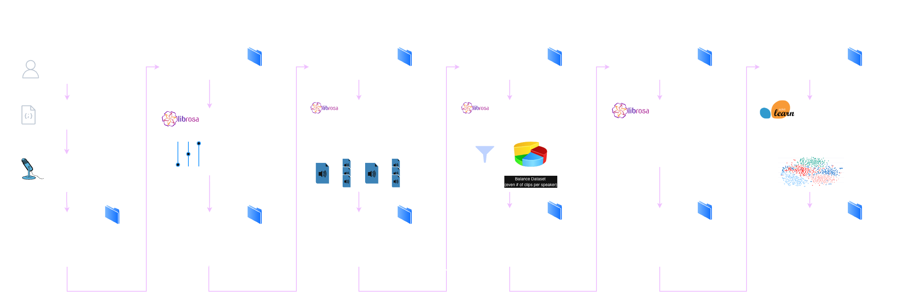

# L.I.S.A. (Labeled Identification of Speech Audio)

An end-to-end supervised machine learning pipeline that produces a model capable of predicting who's speaking from a short clip of speech audio with high accuracy.

## Overview

### System Diagram



### Project Structure

```
lisa/
│
├── app/                        # Local app with visualizations and model deployment
│ └── app.py                    # Multi-page Streamlit UI detailing pipeline methodology with visualizations
│ └── demo.py                   # Gradio demo that processes live mic input and feeds it to the model via stream processing
|
├── data/                       # Data
│ └── generated/                # Generated dataset of voice recordings
│   ├── raw_recordings/         # Folders for each speaker with raw recordings
│   ├── cleaned_recordings/     # Folders for each speaker with cleaned recordings
│   ├── processed_clips/        # Folders for each speaker with split fixed-length audio clips
│   ├── filtered_balanced_clips/    # Folders for each speaker with filtered audio clips, balanced by undersampling
│   └── model/                  # Saved model assets and evaluation outputs
│       ├── evaluation/         # Model evaluation metrics and metadata
│       ├── random_forest.pkl   # Serialized Random Forest model
│       ├── <...>.pkl           # Serialized versions of all other trained models
│       └── scaler.pkl          # Saved feature scaler for preprocessing
│   └── manifest.csv            # Table describing the dataset files
│   └── vocal_features.csv      # Extracted features CSV
│ └── recording-prompts.json    # Voice recording instructions and reading content
│
├── src/                        # ML pipeline source code
│ ├── 0-get-data.py             # Starts the data generation process
│ ├── 1-clean-audio.py          # Cleans raw audio by normalizing levels and reducing background noise
│ ├── 2-split-clips.py          # Splits cleaned audio into fixed-length clips
│ ├── 3-filter-and-balance.py   # Applies filtering and balances classes through undersampling
│ ├── 4-extract-features.py     # Extracts MFCC means and deltas (acoustic features)
│ ├── config.py                 # Centralized configuration settings
│ └── run-pipeline.py           # Executes the full pipeline assuming audio is already collected (Steps 1-6)
│
├── config.yaml                 # YAML configuration for paths and parameters
├── README.md
├── requirements.txt
└── .gitignore

```

## Getting Started

### 1. Clone the repository

```bash
git clone https://github.com/marcolanfranchi/lisa.git
cd lisa
```

### 2. Create and activate a virtual environment

On MacOS and Linux:

```bash
python3 -m venv venv
source venv/bin/activate
```
On Windows:

```bash
python3 -m venv venv
venv\Scripts\Activate.ps1
```

### 3. Install dependencies

```bash
pip install -r requirements.txt
```

## Running the ML Pipeline

### Before we look at each step

If you already have your raw audio recordings generated or downloaded, you can run the entire pipeline (including model training) with a single command. The command below requires that there are multiple folders in `data/generated/raw_recordings/` with at least one .wav file of speech audio per folder. Each folder represents a speaker class that will be in the final model.

```bash
python3 src/run-pipeline.py
```

If you would like to run the pipeline steps individually, whether including audio collection (step 0) or not, follow the steps below that detail how to run each script and what it does.

### 0. Generate your audio data 

This step must be performed for 2 or more people to build a multi-speaker dataset.

```bash
python3 src/0-get-data.py
```
<!-- <details>
<summary>What this script does:</summary>
- Prompts the user with recording instructions loaded from a JSON file.
- Records 60-second audio sessions with countdown and progress bar feedback.
- Splits each recording into overlapping 2s clips (50% overlap), trims silence, and discards too-short segments (max 79 segments per 1 min recording).
- Saves processed clips with unique IDs in a structured folder (processed_clips/speaker_id/).
- Generates a manifest CSV containing metadata (clip paths, speaker ID, script ID, timestamps).
- Generated dataset of audio recordings gets placed into `data/generated/`.
</details> -->


### 1. Clean/normalize audio levels

```bash
python3 src/1-clean-audio.py
```
<!-- <details> <summary>What this script does</summary>
- Normalizes volume levels across clips.
- Removes excessive background noise.
- Outputs cleaned audio recordings to data/generated/cleaned_recordings/.
</details> -->


### 2. Split Audio Clips
```bash
python3 src/2-split-clips.py
```
<!-- <details> <summary>What this script does</summary>
- Splits audio clips into fixed length clips with 50% overlap per clip.
- Outputs cleaned audio recordings to data/generated/processed_clips/.
</details> -->


### 3. Filter & Balance Audio Clips
```bash
python3 src/3-filter-and-balance.py
```
<!-- <details> <summary>What this script does</summary>
- ...
</details> -->


### 4. Extract Features
```bash
python3 src/4-extract-features.py
```
<!-- <details> <summary>What this script does</summary>
- ...
</details> -->


### 5. Train Model
```bash
python3 src/5-train-model.py
```
<!-- <details> <summary>What this script does</summary>
- ...
</details> -->


## Running the Interactive Interface
We made a streamlit UI and a gradio component to demonstrate our model in real time.
- Note: if your virtual environment is inactive, reactivate it before running these commands:

### Run the Streamlit App

```bash
streamlit run app/app.py
```
This will run the Streamlit interface at [http://localhost:8501](http://localhost:8501).

### Run the Model Demo

```bash
python3 app/demo.py
```
This will run the Gradio model demo (at [http://localhost:7860](http://localhost:7860)), which will be displayed in the home page of the Streamlit app as an embedded frame when both are running.
