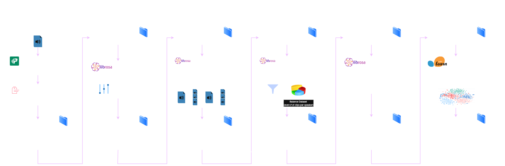

# L.I.S.A. (Labeled Identification of Speech Audio)

An end-to-end supervised machine learning pipeline that produces a model capable of predicting who's speaking from a short clip of speech audio with high accuracy.

## Overview

### System Diagram



### Project Structure

```
speaker-recognition/
│
├── app/                        # Streamlit app containing model demo + data visualizations
│ └── appPages/                 # ...
│   └── reusablePages/          # ...
│   └── components.py           # ...
│   └── homePage.py             # ...
│   └── page0.py                # ...
│   └── page<page_number>.py    # ...
│ └── app.py                    # ...
│ └── config.py                 # ...
│ └── demo.py                   # ...
│ └── utils.py                  # ...
|
├── data/                       # Data
│ └── generated/                # Generated dataset of voice recordings
│   └── raw_recordings/         # Folders for each speaker with raw recordings
│   └── cleaned_recordings/     # Folders for each speaker with cleaned recordings
│   └── processed_clips/        # Folders for each speaker with split audio clips
│   └── manifest.csv            # Table describing the dataset files
│ └── recording-prompts.json    # Voice recording instructions
│
├── models/                     # Stored model .pkl files
│ └── lisa_knn.pkl              # ...
│ └── ...                       # ...
│ └── ...                       # ...
│ └── ...                       # ...
|
├── src/                        # Source code
│ └── 0-get-data.py             # Starts the data generation process
│ └── 1-clean-audio.py          # Cleans raw audio (mp3/wav)
│ └── 2-split-clips.py          # ...
│ └── 3-filter-and-balance.py   # ...
│ └── 4-extract-features.py     # ...
│ └── config.py                 # ...
│ └── run-pipeline.py           # ...
│
├── config.yaml
├── README.md
├── requirements.txt
└── .gitignore
```

## Getting Started

### 1. Clone the repository

```bash
git clone https://github.com/marcolanfranchi/speaker-recognition.git
cd speaker-recognition
```

### 2. Create and activate environment

```bash
python3 -m venv venv
source venv/bin/activate
```

### 3. Install dependencies

```bash
pip install -r requirements.txt
```

## Data Pipeline

### 0. Generate your audio data 

This step should be performed for 3–5 people to build a multi-speaker dataset.

```bash
python3 src/0-get-data.py
```
<details>
<summary>What this script does:</summary>
- Prompts the user with recording instructions loaded from a JSON file.
- Records 60-second audio sessions with countdown and progress bar feedback.
- Splits each recording into overlapping 2s clips (50% overlap), trims silence, and discards too-short segments (max 79 segments per 1 min recording).
- Saves processed clips with unique IDs in a structured folder (processed_clips/speaker_id/).
- Generates a manifest CSV containing metadata (clip paths, speaker ID, script ID, timestamps).
- Generated dataset of audio recordings gets placed into `data/generated/`.
</details>


### 1. Clean/normalize audio levels

```bash
python3 src/1-clean-audio
```
<details> <summary>What this script does</summary>
- Normalizes volume levels across clips.
- Removes excessive background noise.
- Outputs cleaned audio recordings to data/generated/cleaned_recordings/.
</details>


### 2. Split Audio Clips
```bash
python3 src/2-split-clips
```
<details> <summary>What this script does</summary>
- Splits audio clips into fixed length clips with 50% overlap per clip.
- Outputs cleaned audio recordings to data/generated/processed_clips/.
</details>


### 3. Filter & Balance Audio Clips
```bash
python3 src/3-filter-and-balance
```
<details> <summary>What this script does</summary>
- ...
</details>


### 4. Extract Features
```bash
python3 src/4-extract-features
```
<details> <summary>What this script does</summary>
- ...
</details>


### 5. Train Model
```bash
python3 src/5-train-model
```
<details> <summary>What this script does</summary>
- ...
</details>


## Running the Interactive Interface
We made a streamlit UI and a gradio component to demonstrate our model in real time.
- Note: if your virtual environment is inactive, reactivate it before running these commands:

### Run the Streamlit App

```bash
python3 app/app.py
```
This will run the main Streamlit/Python interface at [http://localhost:8501](http://localhost:8501).

### Run the Model Demo

```bash
python3 app/demo.py
```
This will run the Gradio/Python model demo (at [http://localhost:7860](http://localhost:7860)), which will be displayed in the home page of the Streamlit app as an embedded frame.